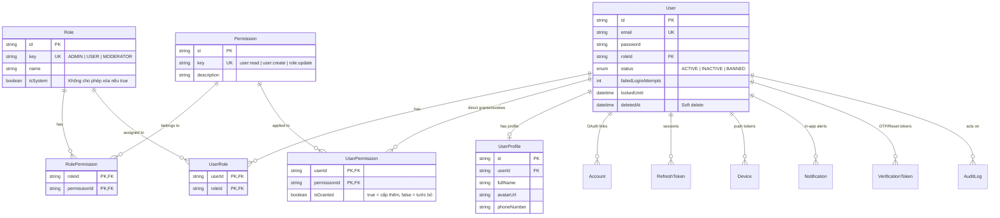
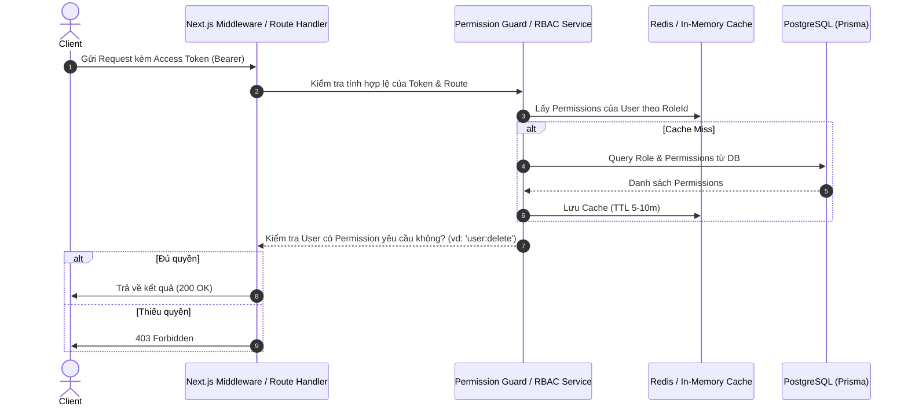

# 🚀 Hướng Dẫn Kiến Trúc & Lộ Trình Phát Triển Hệ Thống RBAC & Auth (Next.js + Prisma)

Tài liệu này cung cấp hướng dẫn toàn diện về kiến trúc phân quyền **RBAC (Role-Based Access Control)**, cơ chế xác thực bảo mật và các bước triển khai/mở rộng trong dự án `nextjs_prisma_base`.

---

## 📌 1. Triết Lý Thiết Kế & Kiến Trúc

### 1.1. Tại sao KHÔNG tách riêng bảng `Admin` và bảng `User`?
- **Tránh trùng lặp mã nguồn (DRY):** Hệ thống xác thực (Bcrypt hash, JWT access token, Refresh Token rotation, OAuth Google/Github/Apple, OTP Email) được dùng chung cho mọi đối tượng.
- **Dễ mở rộng vai trò (Extensibility):** Hỗ trợ thêm nhiều vai trò mới như `SUPER_ADMIN`, `ADMIN`, `MODERATOR`, `ACCOUNTANT`, `USER`, `VIP_USER` mà không cần sửa cấu trúc bảng cơ sở dữ liệu.
- **Tối ưu quan hệ dữ liệu (Data Integrity):** Các bảng nghiệp vụ (`AuditLog`, `Order`, `Post`, `Comment`...) chỉ cần trỏ khóa ngoại `userId` duy nhất về bảng `User`.

### 1.2. Sơ đồ dữ liệu (Entity Relationship Diagram)



---

## 🛠️ 2. Quy Trình Hoạt Động Cốt Lõi (Core Workflows)

### 2.1. Luồng Xác thực (Authentication)
1. **Đăng nhập (Password hoặc OAuth):**
   - Kiểm tra `status === ACTIVE` và `lockedUntil < now()`.
   - Nếu đăng nhập sai quá số lần quy định (`failedLoginAttempts >= 5`) -> Khóa tạm thời tài khoản (`lockedUntil = now() + 15m`).
   - Cấp cặp Token:
     - **Access Token (JWT ngắn hạn - 15 phút):** Chứa `userId`, `roleKey`, và danh sách `permissions` (hoặc truy vấn nhanh qua cache Redis).
     - **Refresh Token (Dài hạn - 7 ngày):** Lưu bản băm `tokenHash` trong bảng `RefreshToken` (áp dụng Refresh Token Rotation chống trộm token).

2. **Đăng xuất:**
   - Cập nhật `revokedAt = now()` trong bảng `RefreshToken` tương ứng với session hiện tại.

---

### 2.2. Luồng Phân Quyền (Authorization Flow)



---

## 📋 3. Lộ Trình Triển Khai & Phát Triển (Development Roadmap)

### Giai Đoạn 1: Seeding Dữ Liệu & Khởi Tạo Phân Quyền Cơ Bản
- [ ] **Tạo Permissions chuẩn theo chuẩn `resource:action`**:
  - Quản lý người dùng: `user:read`, `user:create`, `user:update`, `user:delete`, `user:ban`
  - Quản lý vai trò & quyền: `role:read`, `role:create`, `role:update`, `role:delete`
  - Nhật ký hệ thống: `audit:read`
- [ ] **Tạo Roles mặc định (`isSystem: true`)**:
  - `SUPER_ADMIN`: Toàn quyền tất cả permissions.
  - `ADMIN`: Quản lý người dùng và nghiệp vụ thông thường.
  - `USER`: Quyền cơ bản (đọc thông tin của chính mình, cập nhật profile).
- [ ] Viết file `prisma/seed.ts` để tự động khởi tạo khi setup dự án.

---

### Giai Đoạn 2: Xây Dựng Service & Middleware Bảo Vệ
- [ ] **Tạo Utility / Decorator kiểm tra quyền (`requirePermission`)**:
  ```typescript
  // Ví dụ hàm guard kiểm tra quyền trong Route Handler
  export async function checkPermission(userId: string, requiredPermission: string): Promise<boolean> {
    const user = await prisma.user.findUnique({
      where: { id: userId },
      include: {
        role: {
          include: {
            permissions: {
              include: { permission: true }
            }
          }
        }
      }
    });

    if (!user || user.status !== 'ACTIVE') return false;
    if (user.role.key === 'SUPER_ADMIN') return true; // Super admin bypass

    return user.role.permissions.some(
      (rp) => rp.permission.key === requiredPermission
    );
  }
  ```
- [ ] Tích hợp ghi `AuditLog` tự động mỗi khi có thay đổi quan trọng (gán quyền, khóa tài khoản, đổi mật khẩu).

---

### Giai Đoạn 3: Nâng Cấp Nâng Cao (Khi Hệ Thống Phát Triển Lớn)

#### 1. Tách Hồ Sơ Người Dùng (`UserProfile`)
Tránh để bảng `User` bị phình to khi thêm các trường như địa chỉ, ảnh đại diện, ngày sinh, CCCD/CMND:
```prisma
model UserProfile {
  id          String    @id @default(cuid())
  userId      String    @unique
  user        User      @relation(fields: [userId], references: [id], onDelete: Cascade)
  fullName    String?
  avatarUrl   String?
  phoneNumber String?
  address     String?
  birthday    DateTime?

  @@map("user_profiles")
}
```

#### 2. Chuyển Sang Mô Hình Multi-Role (Nếu 1 User có nhiều vai trò)
Nếu nghiệp vụ yêu cầu một người vừa làm `STAFF` vừa làm `ACCOUNTANT`:
```prisma
model UserRole {
  userId String
  roleId String
  user   User   @relation(fields: [userId], references: [id], onDelete: Cascade)
  role   Role   @relation(fields: [roleId], references: [id], onDelete: Cascade)

  @@id([userId, roleId])
  @@map("user_roles")
}
```

#### 3. Cấp / Chặn Quyền Trực Tiếp Cho Từng User (`UserPermission`)
Giải quyết bài toán: **2 người có cùng vai trò `STAFF`, nhưng Nhân viên A được sếp cấp thêm quyền `order:delete` (hoặc bị tước quyền `order:create`), còn Nhân viên B thì không.**

```prisma
model UserPermission {
  userId       String
  permissionId String
  isGranted    Boolean  @default(true) // true = CẤP THÊM quyền, false = CHẶN quyền (Revoke)
  grantedBy    String?  // ID của Admin đã cấp quyền này (phục vụ audit)
  createdAt    DateTime @default(now())

  user         User       @relation(fields: [userId], references: [id], onDelete: Cascade)
  permission   Permission @relation(fields: [permissionId], references: [id], onDelete: Cascade)

  @@id([userId, permissionId])
  @@index([permissionId])
  @@map("user_permissions")
}
```

> **⚡ Thuật toán tính quyền thực tế (Effective Permissions):**  
> $$\text{Quyền thực tế} = (\text{Tổng Permissions từ các Roles}) + (\text{Quyền cấp thêm}) - (\text{Quyền bị chặn})$$

```typescript
export async function getUserEffectivePermissions(userId: string): Promise<string[]> {
  const user = await prisma.user.findUnique({
    where: { id: userId },
    include: {
      userRoles: {
        include: {
          role: {
            include: {
              permissions: { include: { permission: true } }
            }
          }
        }
      },
      userPermissions: {
        include: { permission: true }
      }
    }
  });

  if (!user) return [];

  // 1. Gộp toàn bộ quyền từ các Roles
  const permissions = new Set<string>();
  user.userRoles.forEach((ur) => {
    ur.role.permissions.forEach((rp) => {
      permissions.add(rp.permission.key);
    });
  });

  // 2. Áp dụng quyền cấp thêm (isGranted: true) hoặc tước bỏ (isGranted: false)
  user.userPermissions.forEach((up) => {
    if (up.isGranted) {
      permissions.add(up.permission.key);
    } else {
      permissions.delete(up.permission.key);
    }
  });

  return Array.from(permissions);
}
```

#### 4. Tối Ưu Hiệu Năng Với Redis Cache
- Cache danh sách `permissions` của từng `roleKey` hoặc `userId` vào Redis với TTL ngắn (5 - 15 phút).
- Khi Admin cập nhật quyền của Role hoặc User -> Xóa cache (Cache Invalidation) để quyền mới có hiệu lực ngay lập tức mà không cần chờ token hết hạn.

---

### Giai Đoạn 4: Push Notification & Quản Lý Đa Thiết Bị (Device & In-App Notification)

#### 1. Tại sao `RefreshToken` KHÔNG THỂ thay thế bảng `Device`?
- **`RefreshToken` (Session Auth):** Vòng đời ngắn, thay đổi liên tục khi xoay vòng token (Refresh Token Rotation) hoặc bị xóa khi hết hạn (7-30 ngày). 1 máy mở nhiều tab có thể sinh nhiều dòng `RefreshToken`.
- **`Device` (FCM Token / Push Token):** Vòng đời dài (gắn liền với thiết bị cho đến khi gỡ app). 1 máy vật lý chỉ có **đúng 1 FCM Token duy nhất**. Nếu nhét vào `RefreshToken`, khi gửi push khách hàng sẽ bị nổ chuông trùng lặp 5-10 lần cho 1 thông báo!

#### 2. Cấu Trúc Bảng Device & Notification
```prisma
enum DevicePlatform {
  IOS
  ANDROID
  WEB
}

model Device {
  id         String         @id @default(cuid())
  userId     String
  user       User           @relation(fields: [userId], references: [id], onDelete: Cascade)
  platform   DevicePlatform // IOS | ANDROID | WEB
  fcmToken   String         // Token nhận push từ Firebase FCM / APNs
  deviceId   String?        // UUID phần cứng máy
  deviceName String?        // "iPhone 15 Pro", "Chrome Windows"
  isActive   Boolean        @default(true)
  lastSeenAt DateTime       @default(now())
  createdAt  DateTime       @default(now())
  updatedAt  DateTime       @updatedAt

  @@unique([userId, fcmToken])
  @@index([userId])
  @@index([fcmToken])
  @@map("devices")
}

enum NotificationType {
  SYSTEM    // Thông báo chung từ hệ thống
  ORDER     // Đơn hàng / Đặt chỗ
  PAYMENT   // Thanh toán
  SECURITY  // Cảnh báo bảo mật (đổi pass, login lạ)
}

model Notification {
  id        String           @id @default(cuid())
  userId    String
  user      User             @relation(fields: [userId], references: [id], onDelete: Cascade)
  title     String           // Tiêu đề
  body      String           // Nội dung
  type      NotificationType @default(SYSTEM)
  data      Json?            // Payload đính kèm (vd: { "orderId": "123", "url": "/orders/123" })
  isRead    Boolean          @default(false)
  readAt    DateTime?
  createdAt DateTime         @default(now())

  @@index([userId, isRead])
  @@index([userId, createdAt])
  @@map("notifications")
}
```

#### 3. Quy Trình Gửi Push Notification (Flow)
1. **Client (Mobile/Web):** Đăng nhập -> Lấy `fcmToken` từ Firebase SDK -> Gọi API `POST /api/devices/register` lưu vào bảng `Device`.
2. **Backend (Event Trigger):** Khi có sự kiện (vd: Đơn hàng thành công) -> Lưu vào bảng `Notification` -> Lấy tất cả `fcmToken` của `userId` từ bảng `Device` -> Đẩy Job vào **BullMQ Worker**.
3. **Queue Worker:** Worker gọi Firebase Admin SDK (`sendEachForMulticast`) để bắn thông báo tức thì đến tất cả thiết bị của người dùng. Nếu Firebase báo token hết hạn -> Tự động xóa bản ghi trong bảng `Device`.

---

## 🔒 5. Best Practices Về Bảo Mật

1. **Không bao giờ lưu Refresh Token dạng Plaintext:** Luôn băm trước khi lưu (`tokenHash = sha256(rawToken)`).
2. **Refresh Token Rotation:** Mỗi lần cấp Access Token mới qua Refresh Token, hãy hủy Refresh Token cũ và sinh Refresh Token mới.
3. **Bảo vệ System Roles:** Không cho phép API sửa/xóa các Role có `isSystem: true` (ví dụ `SUPER_ADMIN`).
4. **Soft Delete (`deletedAt`):** Không xóa cứng `User` trong DB để đảm bảo tính toàn vẹn dữ liệu lịch sử và Audit Log.
